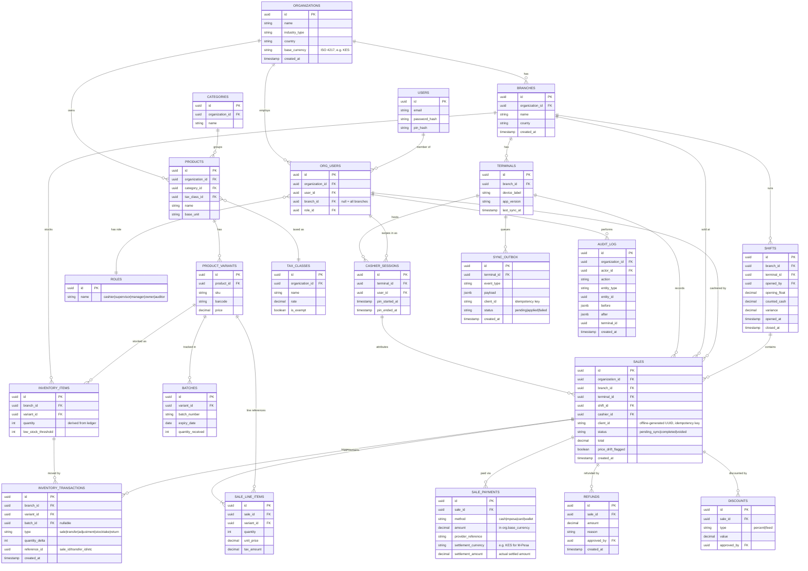

# ZARODA POS — Design Document v0.1

**Status:** Reviewed — greenfield UI, PIN-switching shared terminals, multi-currency at org level all decided (§9). Awaiting final go-ahead before scaffolding.
**Target scale (launch):** small pilot — 1–10 tenants, 1–5 branches per tenant, <10 terminals total, low transaction volume. Architecture keeps escape hatches to mid-size (connection pooling discipline, event-driven module boundaries) without paying microservice-grade operational cost on day one.
**Market:** Kenya-first. M-Pesa (Daraja) is a first-class payment method, not an add-on. Offline reliability is a correctness requirement, not a nice-to-have.
**First vertical:** Retail / general trade.

---

## 1. Tech stack (confirmed, no changes from proposal)

At this scale, a modular monolith is the right call — microservices would add operational cost (service discovery, distributed tracing, N deployments) with no corresponding benefit for <10 terminals. Service-ready boundaries are preserved via the module contract (§3) so extraction later is a refactor, not a rewrite.

- **Backend:** NestJS, modular monolith, one deployable.
- **Frontend (back-office):** Next.js 14 App Router.
- **Frontend (POS terminal):** separate PWA — offline-capable, IndexedDB-backed, deployed independently from the back-office app.
- **Database:** PostgreSQL, Row-Level Security for tenant isolation. Single instance at this scale; no sharding, no read replicas yet.
- **Queue/cache:** Redis + BullMQ — async jobs (receipt printing, SMS, sync reconciliation, low-stock alerts).
- **Monorepo:** pnpm workspaces.
- **Payments:** M-Pesa Daraja (STK Push for customer-present, C2B for paybill-style), a `PaymentProcessor` interface so a card processor can be added later without touching sale logic, cash handled natively (no external processor).
- **SMS/notifications:** Africa's Talking behind a `NotificationProvider` interface (swap providers without touching call sites).

---

## 2. Multi-tenancy & RLS

Hierarchy: **Organization** (tenant) → **Branch** (store/outlet) → **Terminal** (register/device) → **User session** (staff, scoped to org, permissions can be branch-restricted).

Every tenant-owned table carries `organization_id`. A Postgres RLS policy on each such table enforces:

```sql
CREATE POLICY tenant_isolation ON sales
  USING (organization_id = current_setting('app.current_tenant')::uuid);
```

A NestJS request-scoped interceptor reads `organization_id` from the authenticated JWT and issues `SET LOCAL app.current_tenant = '<uuid>'` at the start of every DB transaction. This makes tenant leakage a database-enforced invariant, not an application-trust invariant — a bug in a query's `WHERE` clause cannot leak another tenant's rows.

`SUPER_ADMIN`-only operations (platform ops, not tenant staff) run under a separate connection role that bypasses RLS explicitly (`BYPASSRLS`), used only by internal admin tooling, never by tenant-facing request paths.

---

## 3. Module contract (the part that keeps verticals from forking the core)

Core **never** imports from a vertical module package. Modules depend on core; the dependency arrow only ever points one way. A vertical is added by writing a new package under `packages/modules/<vertical>` that registers a **manifest** with the core's `ModuleRegistry` at bootstrap:

```ts
interface IndustryModuleManifest {
  industryType: string; // "RETAIL" | "RESTAURANT" | "PHARMACY" | "SALON" | ...

  // Additional fields a sale needs. Prefer a dedicated 1:1 extension table
  // (e.g. restaurant_sale_details) over JSONB for anything reported on or
  // queried — JSONB is reserved for flexible, rarely-queried metadata only.
  transactionExtensions?: {
    tableName: string;
    dto: ClassConstructor<unknown>; // validated shape for the extension row
  };

  // New first-class entities the module owns outright (tables, appointments,
  // kitchen tickets, prescriptions...). Modules manage their own migrations.
  entityExtensions?: EntityDefinition[];

  // Terminal PWA panels this module contributes, keyed by org.industry_type
  // so the terminal only mounts what's relevant to that tenant.
  uiPanels?: { id: string; mountPoint: "pos-main" | "pos-sidebar" | "backoffice"; }[];

  // Report definitions contributed to the core reporting module.
  reports?: { id: string; label: string; requiredRole: Role }[];

  // Subscribers to core domain events. In-process now (EventEmitter2), but
  // shaped like external subscribers so a later split into a real service
  // (event bus / queue) changes transport, not the handler contract.
  hooks?: {
    event: "sale.beforeComplete" | "sale.afterComplete"
      | "inventory.beforeDecrement" | "refund.afterApproved" | string;
    handler: (payload: unknown) => Promise<void>;
  }[];
}
```

`CoreModule.forRoot({ enabledModules: [RetailModule, RestaurantModule, ...] })` wires every shipped module at startup. All four verticals can be compiled into the monolith from day one — a given organization's `industry_type` simply determines which UI panels/hooks actually engage for that tenant. An org not using the restaurant module just never populates `restaurant_tables`; the tables exist but sit empty. This avoids conditional-compilation complexity while keeping verticals logically isolated.

**Why this satisfies "add a vertical without touching core":** the core sale-completion pipeline calls `emit('sale.afterComplete', sale)` and returns — it has no knowledge of which modules are listening or what they do. A new vertical subscribes to the same event names an existing one does; core code is never edited to add a fifth industry.

---

## 4. Core entity model

Full detail in the ERD (§5); summarized by concern:

- **Identity/tenancy:** `organizations`, `branches`, `terminals`, `users`, `org_users` (role + branch scope), `roles`/`permissions`.
- **Catalog:** `categories`, `products`, `product_variants`, `modifier_groups`, `modifiers`, `product_bundles`, `bundle_items`, `tax_classes`, `tax_rules`.
- **Inventory:** `inventory_items` (current stock per branch+variant, a *derived* value), `inventory_transactions` (append-only ledger — the actual source of truth; `inventory_items.quantity` is maintained by a trigger/materialization from this ledger, never written directly), `batches` (batch/expiry — core capability, not pharmacy-only, since retail perishables need it too), `stock_transfers`, `stock_takes`.
- **Sales:** `sales`, `sale_line_items`, `sale_payments` (1 sale → many payments, split tender), `discounts`, `refunds` (linked to original sale, requires `reason` + `approved_by`).
- **Shift/cash:** `shifts` (open/close, opening float, counted cash, variance — X/Z report basis).
- **Audit:** `audit_log` — append-only, generic (`actor_id`, `action`, `entity_type`, `entity_id`, `before`, `after` as JSONB diff, `terminal_id`, `created_at`). Every price override, void, discount, and refund writes here; this table is never updated or deleted from.
- **Offline sync:** `sync_outbox` (per-terminal queue of pending client-originated events, keyed by client-generated UUID for idempotent replay).

Why the ledger-not-column approach for inventory: an `UPDATE inventory_items SET quantity = quantity - 1` under concurrent load needs row locks and gives you no audit trail of *why* stock moved. An append-only `inventory_transactions` ledger (sale, transfer, adjustment, stocktake, return — each a signed quantity delta) gives correctness under concurrency (inserts don't block each other the way read-modify-write updates do) and a free audit trail. Current stock is `SUM(delta) WHERE branch_id = ? AND variant_id = ?`, kept fast via a materialized/trigger-maintained `inventory_items.quantity` column that's *derived*, not authoritative.

---

## 5. ERD (core + retail vertical)



---

## 6. Offline sync strategy

Design goal (per your answer): **never lose a sale**; stock conflicts are resolved after the fact, not by blocking the cashier.

1. **Local store:** the terminal PWA mirrors a working set into IndexedDB — a periodically-refreshed catalog snapshot (products, prices, tax rules) and a local `sync_outbox` of pending domain events (`sale.created`, `payment.recorded`, `void.requested`, ...).
2. **Client-generated IDs:** every terminal-created record uses a client-generated UUID, never a DB serial. This means records created offline never collide with each other or with server-generated ones, and can be written optimistically before the server has ever seen them.
3. **Selling offline:** a sale completes fully against IndexedDB with `status = pending_sync`. The terminal's *local* cached stock view is optimistically decremented (so a cashier doesn't oversell against their own last-known count on that device), but the authoritative `inventory_transactions` ledger is untouched until sync — no cross-terminal coordination is attempted while offline, because there is nothing to coordinate with.
4. **Sync:** when connectivity returns, the terminal POSTs its outbox to `/api/v1/sync`. A BullMQ worker replays events **in original per-terminal order**, each insert using `ON CONFLICT (client_id) DO NOTHING` — replays and retries are free no-ops.
5. **Inventory conflicts ("resolve after the fact"):** offline sale stock decrements are applied to the ledger unconditionally on sync — sales are truth. This can legitimately push `inventory_items.quantity` negative if two terminals oversold the same last unit while both offline. A negative balance never blocks or reverses anything; it raises a `stock_reconciliation_task` surfaced on a supervisor dashboard ("N items require reconciliation") and optionally a notification. Zero lost sales, at the cost of occasional manual cleanup for a rare edge case.
6. **Price drift:** if the price changed on the server while a terminal was offline, the sale keeps whatever the terminal actually charged (what the customer paid) — never retroactively repriced. The line is flagged `price_drift_flagged` for audit/reporting visibility, not silently corrected.
7. **Ordering-dependent operations:** a void/refund issued offline against a sale queues behind that sale in the same terminal's outbox, since both were created in local sequence — replay order handles this without extra logic.
8. **Terminal/API versioning:** every sync call carries `app_version`; the backend rejects (with an explicit "please update" response) syncs from a terminal build older than a configured floor, so schema changes can deliberately deprecate old builds instead of silently mishandling their payloads. The backend API itself is URI-versioned (`/api/v1/...`), additive-only within a major version — the sync contract is the most conservative surface in the system, since it must tolerate a terminal that's been offline for days.

---

## 7. Non-functional notes (pilot scale)

- **Concurrency on stock decrements:** at pilot scale (<10 terminals), optimistic concurrency (insert-only ledger, no row locks needed) is sufficient — the ledger's append-only nature means concurrent sales never block each other at the DB level. Revisit with `SELECT ... FOR UPDATE` batching or partitioned counters only if/when moving to mid-size scale with real contention.
- **PCI-DSS posture:** actual card PAN data never touches ZARODA's servers — card processing is delegated to a processor (Daraja handles M-Pesa; a card processor would be integrated the same way). The `PaymentProcessor` interface ensures no card data is ever persisted in `sale_payments` beyond a `provider_reference`.
- **DR/backup:** Postgres point-in-time recovery (WAL archiving) with daily base backups, retained 30 days; RLS means a single backup safely contains all tenants, and per-tenant export/restore is a `WHERE organization_id = ?` operation for support cases, not a separate DR mechanism at this scale.
- **Versioning:** covered in §6.8 — API is URI-versioned, terminal app self-reports version and is gated at sync time.

---

## 8. Build roadmap

**Phase 0 — Foundation**
pnpm monorepo scaffold, NestJS core app skeleton, Postgres schema + RLS policies for tenancy tables, auth (JWT + PIN quick-login), RBAC roles, empty `ModuleRegistry`, CI (typecheck + test on push).

**Phase 1 — MVP core (retail-usable)**
Catalog (products/variants/categories/tax), inventory ledger + derived stock, sales pipeline (line items, split payments: cash + M-Pesa STK push), shifts (X/Z report), core reporting (sales by product/branch/cashier/hour), audit log, terminal PWA v1 (sell + view catalog + complete sale offline + sync).

**Phase 2 — Retail module hardening**
Promotions/discount engine, loyalty points, layaway, ESC/POS receipt printer integration, barcode scanner integration, stock transfers, stock takes, low-stock alerts.

**Phase 3 — Non-functional hardening**
Load test stock-decrement path, PCI review of payment flow, DR runbook drilled end-to-end, structured logging/error tracking, sync-conflict dashboard for supervisors.

**Phase 4 — Second vertical (restaurant)**
Built purely as a module against the now-proven contract: table/floor management, order-to-KDS routing, course timing, tips/service charge. Success criterion: zero changes to core packages.

**Phase 5+ — Pharmacy, salon**
Same pattern. Batch/expiry enforcement and controlled-substance flags for pharmacy (batches table already exists in core — pharmacy module adds enforcement rules + prescription linkage on top). Appointment/resource scheduling for salon.

---

## 9. Decisions from review

**Greenfield UI.** No existing brand/design system to match — back-office and terminal PWA get their own component system (shadcn/ui + Tailwind, consistent with the team's other tooling), built for this product rather than adapted.

**PIN-switching on shared terminals.** A terminal is authenticated at the *device* level (long-lived device token, set up once by a manager), but individual sales are attributed to whichever cashier is currently "swiped in" via PIN — multiple cashiers can share one physical terminal across a shift. This adds a `cashier_sessions` table: `terminal_id`, `user_id`, `pin_started_at`, `pin_ended_at`. `sales.cashier_id` is set from the active `cashier_session` at the moment of sale, not from the device login. A PIN switch mid-transaction (parked sale) is disallowed — a parked sale must be resumed by the cashier who parked it, or explicitly reassigned by a supervisor (audit-logged), so accountability for an open sale is never ambiguous.

**Multi-currency from day one.** Currency is set at the **organization** level (`organizations.base_currency`, ISO 4217 code) — branches within one org share a currency; a chain operating across two countries is modeled as two organizations, not mixed currencies in one. Every monetary column that can be customer-facing (`sale_line_items.unit_price`, `sales.total`, `discounts.value` when fixed-amount, `product_variants.price`) is interpreted in the org's `base_currency`; no per-line currency field, no exchange-rate table needed at this scale, since an org never mixes currencies internally. M-Pesa payments are always KES-settled by Safaricom regardless of the org's base currency — for a non-KES org, `sale_payments.provider_reference` still records the M-Pesa transaction, but the amount charged via STK push is converted to KES at time of payment using a manually-configured or provider-supplied rate, stored on that specific payment row (`sale_payments.settlement_currency`, `sale_payments.settlement_amount`) so the conversion is auditable per-transaction rather than a global rate that drifts silently.

Schema additions from this section: `organizations.base_currency`, `cashier_sessions` table, `sale_payments.settlement_currency` / `sale_payments.settlement_amount`.

---

**Status: approved pending your final go-ahead below.** Reply to confirm and I'll start Phase 0 (monorepo scaffold).
